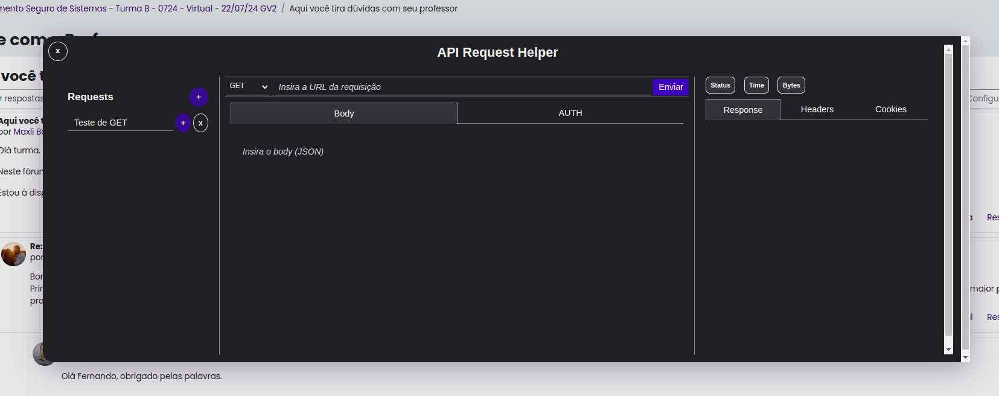

# API Request Helper - Extensão para Google Chrome

## 1. Introdução (Português)
O **API Request Helper** é um cliente REST simples e leve, projetado para realizar requisições HTTP diretamente no navegador Google Chrome. Esta extensão é ideal para desenvolvedores que desejam testar endpoints em desenvolvimento ou analisar respostas de APIs externas de maneira rápida, sem a necessidade de instalar softwares como Insomnia ou Postman.

O objetivo é oferecer uma alternativa prática para execução de requisições simples. Não visa implementar todas as funcionalidades de um cliente REST completo como o Postman ou Insomnia.

## 2. Descrição Geral do Sistema
A extensão fornece uma forma prática para:
1. Testar endpoints de APIs em desenvolvimento.
2. Obter informações de APIs externas.
3. Analisar respostas de APIs e compreender sua estrutura.
4. Verificar cabeçalhos de respostas HTTP.
5. Realizar testes de penetração básicos.

## 3. Requisitos Funcionais

### RF001 – Realizar Requisições HTTP
- **Prioridade**: Essencial  
- **Descrição**: Permitir ao usuário enviar requisições HTTP com diferentes métodos (GET, POST, PUT, PATCH, DELETE) para qualquer URL fornecida.  
- **Fluxo**:
  1. O usuário insere a URL e o método HTTP.
  2. O sistema permite inserir o corpo da requisição (POST, PUT).
  3. O usuário envia a requisição.
  4. A resposta é exibida na tela.

### RF002 – Exibir Cabeçalhos de Resposta HTTP
- **Prioridade**: Essencial  
- **Descrição**: Exibir os cabeçalhos da resposta HTTP.  
- **Fluxo**:
  1. O usuário envia uma requisição.
  2. Os cabeçalhos da resposta são exibidos na interface.

### RF003 – Exibir Corpo da Resposta HTTP
- **Prioridade**: Essencial  
- **Descrição**: Exibir o corpo da resposta em formato JSON ou texto.  
- **Fluxo**:
  1. O usuário envia uma requisição.
  2. Se a resposta for JSON, ela é formatada; se for texto, é exibida como está.

### RF004 – Manipulação de Cookies
- **Prioridade**: Desejável  
- **Descrição**: Exibir cookies recebidos da resposta HTTP, se existirem.  
- **Fluxo**:
  1. O usuário envia uma requisição.
  2. Os cookies recebidos são exibidos.

### RF005 – Permitir Salvar Requests
- **Prioridade**: Desejável  
- **Descrição**: Permitir ao usuário salvar requisições para reutilização futura.  
- **Fluxo**:
  1. O usuário adiciona uma nova requisição e preenche os parâmetros.
  2. O sistema salva a requisição.

---

# API Request Helper - Google Chrome Extension

## 1. Introduction (English)
The **API Request Helper** is a simple and lightweight REST client designed to perform HTTP requests directly from the Google Chrome browser. This extension is especially useful for developers who want to quickly test endpoints in development or analyze responses from external APIs without the need to install software like Insomnia or Postman.

The goal is to provide a practical alternative for performing simple requests. It does not aim to implement all the features of a full-fledged REST client like Postman or Insomnia.

## 2. General System Description
This extension provides a convenient way to:
1. Test API endpoints in development.
2. Retrieve information from external APIs.
3. Analyze API responses to understand their structure.
4. Examine HTTP response headers.
5. Perform basic penetration tests.

## 3. Functional Requirements

### RF001 – Perform HTTP Requests
- **Priority**: Essential  
- **Description**: Allow users to send HTTP requests with different methods (GET, POST, PUT, PATCH, DELETE) to any provided URL.  
- **Flow**:
  1. The user enters the URL and HTTP method.
  2. The system allows adding a request body for supported methods (POST, PUT).
  3. The user sends the request.
  4. The response is displayed on the screen.

### RF002 – Display HTTP Response Headers
- **Priority**: Essential  
- **Description**: Display the headers of the HTTP response.  
- **Flow**:
  1. The user sends a request.
  2. The response headers are displayed on the interface.

### RF003 – Display HTTP Response Body
- **Priority**: Essential  
- **Description**: Display the body of the HTTP response in JSON or text format.  
- **Flow**:
  1. The user sends a request.
  2. If the response is JSON, it is formatted; if it's text, it is displayed as-is.

### RF004 – Cookie Handling
- **Priority**: Desirable  
- **Description**: Display cookies received from the HTTP response, if any.  
- **Flow**:
  1. The user sends a request.
  2. The received cookies are displayed.

### RF005 – Save Requests
- **Priority**: Desirable  
- **Description**: Allow users to save requests for future use with the same parameters.  
- **Flow**:
  1. The user adds a new request and fills in the parameters.
  2. The system saves the request.
